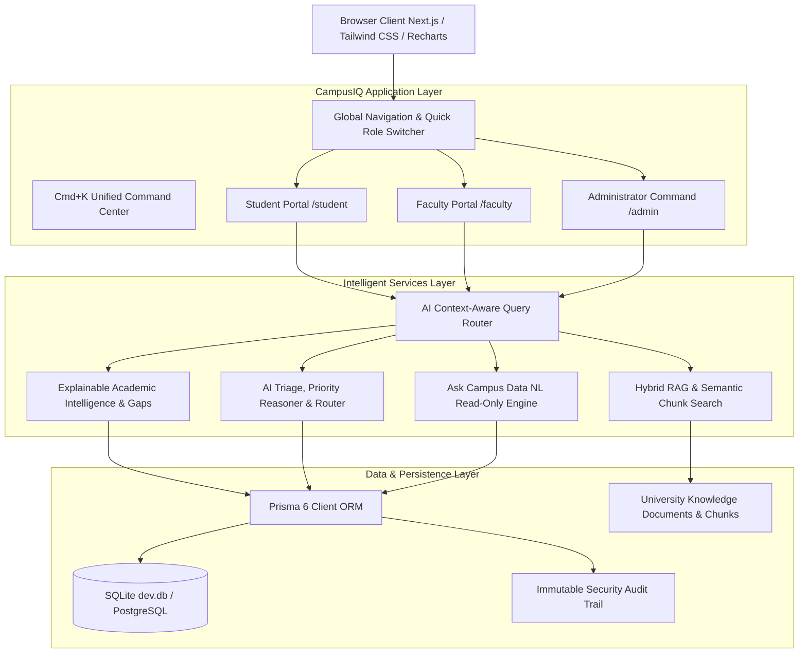
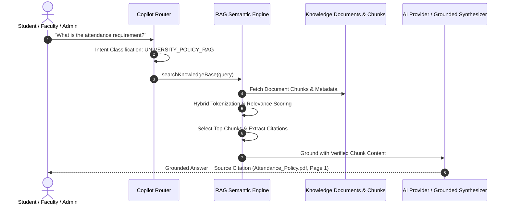
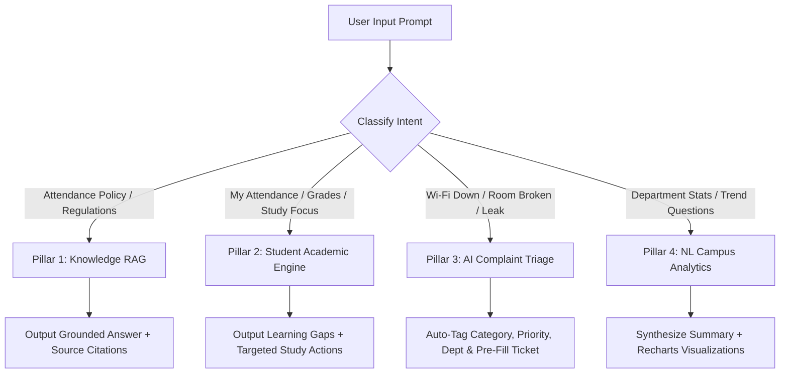
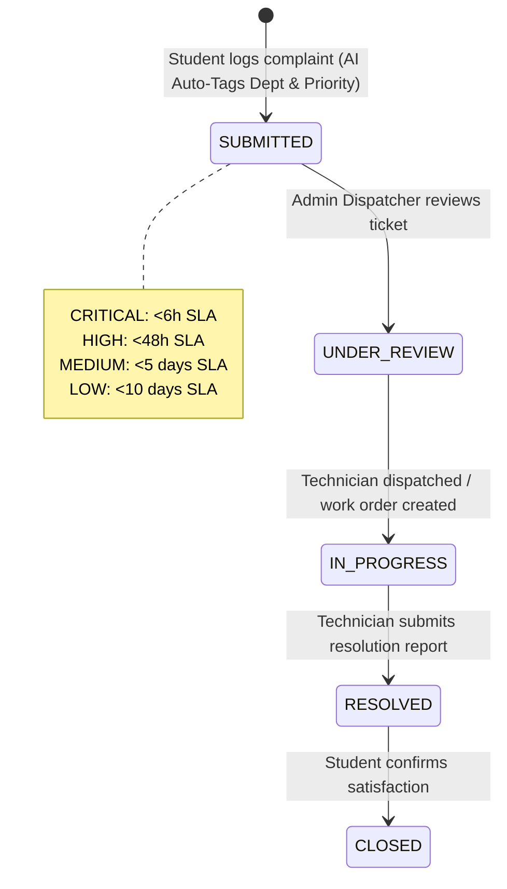

# CampusIQ System Architecture Documentation

## 1. High-Level System Architecture

---

## 2. RAG (Retrieval-Augmented Generation) Pipeline

---

## 3. Context-Aware AI Query Routing Flow

---

## 4. Intelligent Complaint Lifecycle & SLA Escalation

